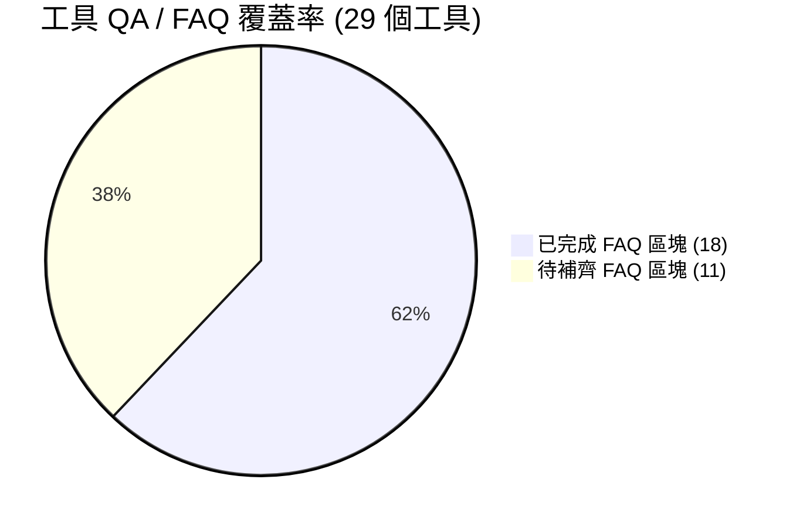

# 🛠️ 全站工具 QA / FAQ 完整盤點與跟進追蹤清單

> **更新日期**：2026-08-22  
> **總工具數量**：29 個  
> **現況概覽**：
> - 🟢 **已完成常見問答（FAQ/QA 結構化與組件）**：**18** 個 (62.1%)
> - 🔴 **尚未完成常見問答（待補齊 FAQ/QA 區塊）**：**11** 個 (37.9%)
> - 🟡 **單元測試/自動化邏輯測試（Quality Assurance Unit Tests）**：待建立（目前僅有 UI 設計規範單元檢查 `tests/check-ui-standards.mjs`）

---

## 📊 總體進度統計看板



| 類別 (Category) | 總工具數 | 已完成 QA | 待完成 QA | 完成率 |
| :--- | :---: | :---: | :---: | :---: |
| 🏦 **金融理財 (finance)** | 9 | 8 | 1 | **88.9%** |
| 💻 **開發輔助 (developer)** | 5 | 3 | 2 | **60.0%** |
| 🌐 **網路工具 (network)** | 4 | 2 | 2 | **50.0%** |
| ✍️ **文字編輯 (text)** | 3 | 1 | 2 | **33.3%** |
| 🔧 **實用小工具 (utility)** | 8 | 4 | 4 | **50.0%** |
| **總計** | **29** | **18** | **11** | **62.1%** |

---

## 🔴 待補齊 QA / FAQ 之工具清單 (共 11 個)

以下工具目前尚未引入 `<FaqSection />` 手風琴組件與 `FAQPage` JSON-LD 結構化資料，建議依優先級進行跟進擴充：

### 1. 🏦 金融理財類

| 狀態 | 工具名稱 | 路徑 | 優先級 | 待辦項目 |
| :---: | :--- | :--- | :---: | :--- |
| ❌ | **真實時薪計算器** | [`app/hourly-rate-calculator/`](file:///c:/PG/smalltools/app/hourly-rate-calculator) | 🟡 中 | • 在 `HourlyRateCalculatorClient.tsx` 加入 `<FaqSection items={FAQ_ITEMS} />`<br>• 在 `page.tsx` 及 `en/page.tsx` 注入 `generateFaqSchema` |

### 2. 💻 開發輔助類

| 狀態 | 工具名稱 | 路徑 | 優先級 | 待辦項目 |
| :---: | :--- | :--- | :---: | :--- |
| ❌ | **JSON 格式化與美化器** | [`app/json/`](file:///c:/PG/smalltools/app/json) | 🔴 高 | • 在 `JsonFormatterClient.tsx` 加入 `<FaqSection items={FAQ_ITEMS} />`<br>• 在 `page.tsx` 及 `en/page.tsx` 注入 `generateFaqSchema` |
| ❌ | **Base64 編碼/解碼** | [`app/base64/`](file:///c:/PG/smalltools/app/base64) | 🟡 中 | • 在 `Base64Client.tsx` 加入 `<FaqSection items={FAQ_ITEMS} />`<br>• 在 `page.tsx` 及 `en/page.tsx` 注入 `generateFaqSchema` |

### 3. 🌐 網路工具類

| 狀態 | 工具名稱 | 路徑 | 優先級 | 待辦項目 |
| :---: | :--- | :--- | :---: | :--- |
| ❌ | **IP 檢測助手** | [`app/ip-detector/`](file:///c:/PG/smalltools/app/ip-detector) | 🟡 中 | • 在 `IpDetectorClient.tsx` 加入 `<FaqSection items={FAQ_ITEMS} />`<br>• 在 `page.tsx` 及 `en/page.tsx` 注入 `generateFaqSchema` |
| ❌ | **DNS HTTPS 紀錄設定產生器** | [`app/https-dns-generator/`](file:///c:/PG/smalltools/app/https-dns-generator) | 🟡 中 | • 在 `HttpsDnsGeneratorClient.tsx` 加入 `<FaqSection items={FAQ_ITEMS} />`<br>• 在 `page.tsx` 及 `en/page.tsx` 注入 `generateFaqSchema` |

### 4. ✍️ 文字編輯類

| 狀態 | 工具名稱 | 路徑 | 優先級 | 待辦項目 |
| :---: | :--- | :--- | :---: | :--- |
| ❌ | **兩份文件比對工具** | [`app/diff-checker/`](file:///c:/PG/smalltools/app/diff-checker) | 🟡 中 | • 在 `DiffCheckerClient.tsx` 加入 `<FaqSection items={FAQ_ITEMS} />`<br>• 在 `page.tsx` 及 `en/page.tsx` 注入 `generateFaqSchema` |
| ❌ | **文字處理助手** | [`app/text-utility/`](file:///c:/PG/smalltools/app/text-utility) | 🟢 一般 | • 在 `TextUtilityClient.tsx` 加入 `<FaqSection items={FAQ_ITEMS} />`<br>• 在 `page.tsx` 及 `en/page.tsx` 注入 `generateFaqSchema` |

### 5. 🔧 實用小工具類

| 狀態 | 工具名稱 | 路徑 | 優先級 | 待辦項目 |
| :---: | :--- | :--- | :---: | :--- |
| ❌ | **Epoch 時間戳記轉換** | [`app/epoch/`](file:///c:/PG/smalltools/app/epoch) | 🟡 中 | • 在 `EpochClient.tsx` 加入 `<FaqSection items={FAQ_ITEMS} />`<br>• 在 `page.tsx` 及 `en/page.tsx` 注入 `generateFaqSchema` |
| ❌ | **光影裁剪 - 萬能圖片處理大師** | [`app/image-processor/`](file:///c:/PG/smalltools/app/image-processor) | 🟡 中 | • 在 `ImageProcessorClient.tsx` 加入 `<FaqSection items={FAQ_ITEMS} />`<br>• 在 `page.tsx` 及 `en/page.tsx` 注入 `generateFaqSchema` |
| ❌ | **目標計時器** | [`app/time/`](file:///c:/PG/smalltools/app/time) | 🟢 一般 | • 在 `TimeClient.tsx` 加入 `<FaqSection items={FAQ_ITEMS} />`<br>• 在 `page.tsx` 及 `en/page.tsx` 注入 `generateFaqSchema` |
| ❌ | **吹牛骰子搖骰器** | [`app/liars-dice/`](file:///c:/PG/smalltools/app/liars-dice) | 🟢 一般 | • 在 `LiarsDiceClient.tsx` 加入 `<FaqSection items={FAQ_ITEMS} />`<br>• 在 `page.tsx` 及 `en/page.tsx` 注入 `generateFaqSchema` |

---

## 🟢 已完成 QA / FAQ 之工具清單 (共 18 個)

| 分類 | 工具名稱 | 目錄路徑 | 中文 QA 筆數 | 英文 Schema | 狀態 |
| :--- | :--- | :--- | :---: | :---: | :---: |
| 金融理財 | **房貸計算機** | [`app/mortgage-loan/`](file:///c:/PG/smalltools/app/mortgage-loan) | 7 則 | ✅ 已配置 | 完整 |
| 金融理財 | **信貸計算機** | [`app/personal-loan/`](file:///c:/PG/smalltools/app/personal-loan) | 8 則 | ✅ 已配置 | 完整 |
| 金融理財 | **薪資、勞保、健保、預扣稅計算機** | [`app/my-salary-calculator/`](file:///c:/PG/smalltools/app/my-salary-calculator) | 8 則 | ✅ 已配置 | 完整 |
| 金融理財 | 複利計算機 | [`app/compound-interest/`](file:///c:/PG/smalltools/app/compound-interest) | 7 則 | ✅ 已配置 | 完整 |
| 金融理財 | 車貸計算機 | [`app/car-loan/`](file:///c:/PG/smalltools/app/car-loan) | 7 則 | ✅ 已配置 | 完整 |
| 金融理財 | 股票質押與維持率壓力測試器 | [`app/pledge-calculator/`](file:///c:/PG/smalltools/app/pledge-calculator) | 7 則 | ✅ 已配置 | 完整 |
| 金融理財 | 台股期貨槓桿與逆風點數估算器 | [`app/futures-calculator/`](file:///c:/PG/smalltools/app/futures-calculator) | 7 則 | ✅ 已配置 | 完整 |
| 金融理財 | 離職時間與預告期計算機 | [`app/resignation-calculator/`](file:///c:/PG/smalltools/app/resignation-calculator) | 9 則 | ✅ 已配置 | 完整 |
| 開發輔助 | URL 編碼/解碼 | [`app/url/`](file:///c:/PG/smalltools/app/url) | 7 則 | ✅ 已配置 | 完整 |
| 開發輔助 | 安全密碼生成器 | [`app/password/`](file:///c:/PG/smalltools/app/password) | 7 則 | ✅ 已配置 | 完整 |
| 開發輔助 | SSL 憑證格式轉換器 | [`app/ssl-converter/`](file:///c:/PG/smalltools/app/ssl-converter) | 7 則 | ✅ 已配置 | 完整 |
| 網路工具 | DIG 網路診斷工具 | [`app/dns-dig/`](file:///c:/PG/smalltools/app/dns-dig) | 7 則 | ✅ 已配置 | 完整 |
| 網路工具 | IP 子網段計算器 | [`app/ip-calculator/`](file:///c:/PG/smalltools/app/ip-calculator) | 7 則 | ✅ 已配置 | 完整 |
| 文字編輯 | Designer QR Code 產生器 | [`app/qr-generator/`](file:///c:/PG/smalltools/app/qr-generator) | 6 則 | ✅ 已配置 | 完整 |
| 實用小工具 | 幸運轉盤抽獎小工具 | [`app/lucky-wheel/`](file:///c:/PG/smalltools/app/lucky-wheel) | 7 則 | ✅ 已配置 | 完整 |
| 實用小工具 | PDF 頁面組合器 | [`app/pdf-processor/`](file:///c:/PG/smalltools/app/pdf-processor) | 7 則 | ✅ 已配置 | 完整 |
| 實用小工具 | PDF 壓縮大師 | [`app/pdf-compressor/`](file:///c:/PG/smalltools/app/pdf-compressor) | 7 則 | ✅ 已配置 | 完整 |
| 實用小工具 | 孕期與產檢假計算機 | [`app/pregnancy-calculator/`](file:///c:/PG/smalltools/app/pregnancy-calculator) | 8 則 | ✅ 已配置 | 完整 |

---

## 🛠️ 標準 QA / FAQ 導入規範範本 (Standard Implementation)

若要為未完成的工具新增 QA / FAQ，請遵照專案標準結構：

### 1. 在 `page.tsx` (以及 `en/page.tsx`) 注入 JSON-LD Schema
```tsx
import { generateFaqSchema, FaqItem } from '@/app/utils/faqSchema';

const FAQ_ITEMS: FaqItem[] = [
  {
    q: '問題標題 1？',
    a: '詳細解答內容 1...',
  },
  // ... 至少 5~7 則問答
];

const faqJsonLd = generateFaqSchema(FAQ_ITEMS);

export default function Page() {
  return (
    <>
      <script
        type="application/ld+json"
        dangerouslySetInnerHTML={{ __html: JSON.stringify(faqJsonLd) }}
      />
      <ToolClient />
    </>
  );
}
```

### 2. 在 `ToolClient.tsx` 底部引入手風琴組件
```tsx
import FaqSection from '../components/FaqSection';

// 在 JSX 的適當容器底部（例如 ToolLayout 內部或主 container 底部）：
<FaqSection
  title={t.faqTitle}
  subtitle={t.faqSubtitle}
  items={t.faqItems}
  accentColor="#00ffaa" // 請對應該工具之主題色
/>
```

---

## 🧪 延伸品質保證（Quality Assurance 軟體測試）規劃建議

目前專案主要依賴 prebuild 階段的 UI 規範單元檢查 [`tests/check-ui-standards.mjs`](file:///c:/PG/smalltools/tests/check-ui-standards.mjs)。針對核心計算模組，後續可擴充 Vitest / Jest 單元測試：

1. **金融試算核心驗證**：
   - 房貸本息/本金均攤公式、多段式階梯利率精準度
   - 股票質押維持率與追繳臨界計算
   - 期貨保證金、槓桿倍數與斷頭點數精算
   - 勞健保薪資級距、預扣所得稅率表試算
2. **網路與編解碼核心驗證**：
   - CIDR / 子網段遮罩計算（廣播位址、可用 IP 範圍）
   - Base64 UTF-8 多位元組文字與二進位檔案完整性
   - DoH DNS 解析封包解碼器（`dnsDecoder.ts`）
3. **時效與日期計算驗證**：
   - 勞基法預告期、離職日推算
   - 預產期與各孕週里程碑推算
